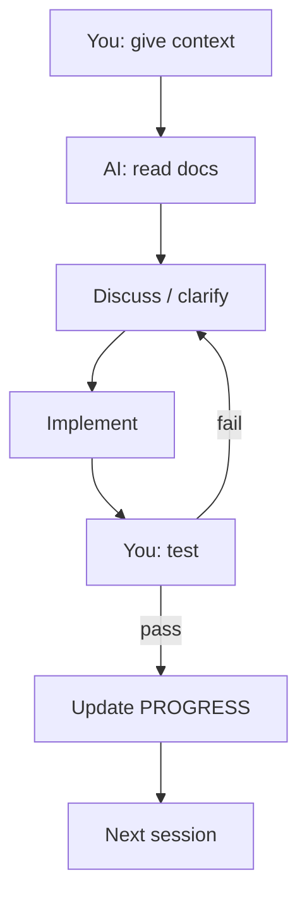
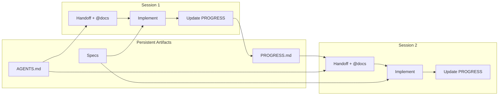
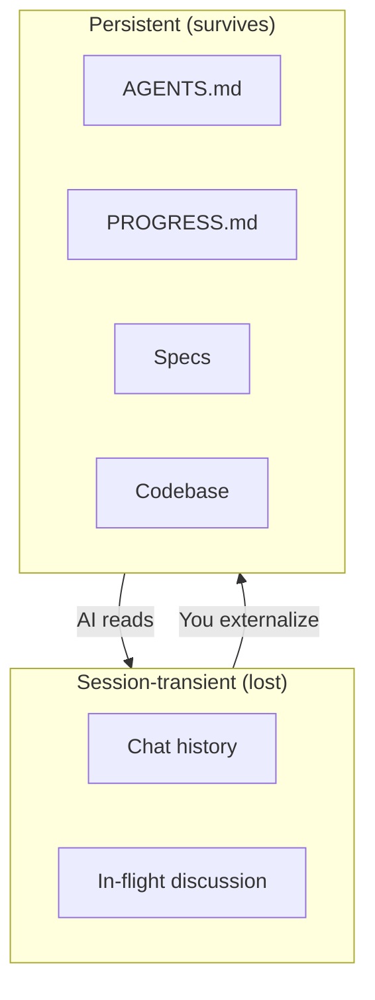

# AI-Supervised Development: How to Keep Context, Track Progress, and Move Between Sessions

This article describes a workflow for building software **with** an AI coding assistant—where you provide context, discuss, configure, implement, and test iteratively—and how to **keep continuity** across sessions and context windows. The goal: avoid losing context when chats end or when the AI’s memory resets.

---

## 1. What Is AI-Supervised Development?

**AI-supervised development** here means:

- **You** steer: you decide what to build, review code, and test.
- **The AI** helps: it reads specs, writes code, suggests setups, and debugs.
- **Together** you move in cycles: discuss → configure → implement → test → document.

You’re not “prompting and hoping.” You’re using the AI as a partner that understands the project and follows your rules, and you keep the project state in **files** so any new session can pick up where you left off.

---

## 2. The Core Problem: Context Windows

Every AI session has limits:

- **Token limit** – Only so much of the conversation fits in one context.
- **Session end** – Chats close; a new chat starts empty.
- **No memory** – The AI doesn’t retain prior chats unless you reintroduce the context.

If you rely on the chat history as the only source of truth, you lose:

- What was decided
- What was implemented
- What failed and why
- What’s next

**Solution:** Treat the **codebase and docs** as the persistent memory. The AI reads from files; you update those files as you go. New sessions bootstrap from the same files.

---

## 3. The Artifact Stack: What Persists

Context lives in **artifacts**, not in the chat:

```
┌─────────────────────────────────────────────────────────────┐
│  SESSION-TRANSIENT (lost when chat ends)                     │
│  • Chat history, in-flight discussion, partial explanations │
└─────────────────────────────────────────────────────────────┘
                              │
                              │  You externalize decisions and state
                              ▼
┌─────────────────────────────────────────────────────────────┐
│  PERSISTENT ARTIFACTS (survive across sessions)             │
├─────────────────────────────────────────────────────────────┤
│  AGENTS.md           │ Project identity, rules, conventions │
│  docs/PROGRESS.md    │ Status, checklist, handoff text      │
│  docs/*.md           │ Specs (PRD, data model, ingestion)   │
│  codebase            │ Implementation, config, migrations   │
│  .env.example        │ Required env vars (no secrets)       │
└─────────────────────────────────────────────────────────────┘
```

The AI learns the project by reading these files. You guide it by:

- Pointing to specific docs (`@docs/PROGRESS.md`)
- Updating PROGRESS after each phase
- Keeping specs and AGENTS.md in sync with reality

---

## 4. The Development Loop

A single session typically looks like this:

```
     ┌──────────────┐
     │   You: give   │
     │   context     │
     │   (@docs,     │
     │   "Day 2...") │
     └──────┬───────┘
            │
            ▼
     ┌──────────────┐
     │  AI: read     │
     │  docs,        │
     │  understand   │
     └──────┬───────┘
            │
            ▼
     ┌──────────────┐
     │  Discuss /   │
     │  clarify      │◄──────────────┐
     └──────┬───────┘                │
            │                        │
            ▼                        │
     ┌──────────────┐                │
     │  Implement   │                │
     │  (or fix)     │                │
     └──────┬───────┘                │
            │                        │
            ▼                        │
     ┌──────────────┐                │
     │  You: test    │                │
     │  (run, curl,  │                │
     │   Postman)    │                │
     └──────┬───────┘                │
            │                        │
            ├─── pass ───────────────┤
            │                        │
            └─── fail ──► Discuss ───┘
                    (share error, retry)
```

You keep cycling until the feature works. Then you **update PROGRESS** and optionally write an article or note for the next session.

---

## 5. Moving Between Context Windows: The Handoff

When you start a **new chat**, the AI has no memory of the previous one. The handoff is a short message that tells it:

1. **Project name**
2. **Current phase / day**
3. **What to do next**
4. **Which docs to load**

Example:

> *"Continue MarketBuzz Compass Day 3: ingestion pipeline (parse, upsert, recompute) + Worker. Use @docs/PROGRESS.md @AGENTS.md @docs/INGESTION_WORKFLOW.md for context. Backend is Fastify, DB is Supabase, monorepo with apps/api and apps/web."*

This lives in **PROGRESS.md** under a "Handoff for New Context" section. You copy-paste it (or a variant) into the first message of each new session.

---

## 6. How We Track Progress

We use a single **Progress Tracker** (`docs/PROGRESS.md`) with:

| Section | Purpose |
|---------|---------|
| **Status line** | One-line summary: "Day 2 complete → Day 3 next" |
| **Phase checklist** | Grouped tasks (DB, AWS, API, Ingestion, etc.) with [x] / [ ] |
| **Completed Tasks table** | Date, task, notes—for audit and continuity |
| **Troubleshooting** | Common errors and fixes (e.g. env, Swagger) |
| **Blockers / Notes** | What’s blocked or needs manual setup |
| **Handoff for New Context** | Exact phrase to start the next session |

The AI updates PROGRESS when you finish a phase. You (or the AI) update the handoff text when the “next” focus changes.

---

## 7. End-to-End Flow (Diagram)

```
┌─────────────────────────────────────────────────────────────────────────┐
│                        SESSION 1 (e.g. Day 1)                            │
├─────────────────────────────────────────────────────────────────────────┤
│  You: "Set up MarketBuzz Compass: monorepo, Supabase, basic API.        │
│        Use @docs/PROGRESS.md @AGENTS.md"                                 │
│                                                                          │
│  AI: reads docs → implements → you test → pass                            │
│                                                                          │
│  You: "Update PROGRESS.md"                                                │
│  AI: updates checklist, adds Completed Tasks, sets Handoff for Day 2     │
└─────────────────────────────────────────────────────────────────────────┘
                                    │
                                    │  Chat ends. Context lost.
                                    ▼
┌─────────────────────────────────────────────────────────────────────────┐
│                        SESSION 2 (e.g. Day 2)                            │
├─────────────────────────────────────────────────────────────────────────┤
│  You: [paste Handoff from PROGRESS.md]                                    │
│       "Continue MarketBuzz Compass Day 2: S3 + Cognito + auth +          │
│        CSV upload. Use @docs/PROGRESS.md @AGENTS.md @INGESTION_WORKFLOW"  │
│                                                                          │
│  AI: reads PROGRESS, AGENTS, INGESTION_WORKFLOW → understands scope      │
│      implements → you test (Postman, S3, Cognito)                         │
│      hit issues (invalid_client, S3 permissions) → discuss → fix          │
│                                                                          │
│  You: "Create article about Cognito setup"                                │
│  AI: writes docs/articles/aws-cognito-setup-step-by-step.md               │
│                                                                          │
│  You: "Update PROGRESS"                                                   │
│  AI: marks Day 2 complete, sets Handoff for Day 3                          │
└─────────────────────────────────────────────────────────────────────────┘
                                    │
                                    │  Chat ends again.
                                    ▼
┌─────────────────────────────────────────────────────────────────────────┐
│                        SESSION 3 (e.g. Day 3)                            │
├─────────────────────────────────────────────────────────────────────────┤
│  You: [paste updated Handoff]                                             │
│       "Continue MarketBuzz Compass Day 3: ingestion pipeline + Worker"   │
│                                                                          │
│  AI: bootstraps from PROGRESS + AGENTS + INGESTION_WORKFLOW               │
│      No memory of Session 1 or 2, but full context from artifacts         │
└─────────────────────────────────────────────────────────────────────────┘
```

**Key idea:** Each session starts with a handoff + `@` references. The AI loads context from files, not from past chats.

---

## 8. Document Roles

| Document | Role |
|----------|------|
| **AGENTS.md** | Project identity, rules, conventions. The AI follows this. |
| **PROGRESS.md** | Current state, checklist, handoff. Single source of "where we are." |
| **Specs** (PRD, DATA_MODEL, INGESTION_WORKFLOW, etc.) | What to build. AI reads them before implementing. |
| **Articles** (docs/articles/) | Learning notes, how-tos. Optional; helps you and future sessions. |

The AI doesn’t need to have "seen" a prior session. It needs:

- **AGENTS.md** – So it follows the rules.
- **PROGRESS.md** – So it knows status and next steps.
- **Relevant spec** – So it knows what to implement.

---

## 9. Patterns That Work

### 1. Always @-reference key docs

Start sessions with explicit references:

- `@docs/PROGRESS.md`
- `@AGENTS.md`
- `@docs/<relevant-spec>.md`

That forces the AI to load the right files.

### 2. Update PROGRESS when a phase completes

After each phase (or day):

- Mark checklist items done
- Add rows to Completed Tasks
- Update the Handoff text
- Adjust Status line

### 3. Document gotchas as you hit them

When you fix something (Cognito `invalid_client`, S3 permissions, env path), add it to:

- **Troubleshooting** in PROGRESS, or
- A dedicated article

### 4. Keep the handoff short and specific

Good:

> "Continue MarketBuzz Compass Day 3: ingestion pipeline (parse, upsert, recompute) + Worker. Use @docs/PROGRESS.md @AGENTS.md @docs/INGESTION_WORKFLOW.md. Backend Fastify, DB Supabase, monorepo apps/api and apps/web."

Bad:

> "Continue the project."

### 5. Use specs as the contract

Implement from specs. If the AI suggests something that conflicts with a spec, point to the spec. Specs outlive any single chat.

---

## 10. Summary

| Challenge | Approach |
|-----------|----------|
| Context windows end | Persist state in PROGRESS, specs, and code |
| New session has no memory | Handoff message + @-references |
| Losing track of progress | Single PROGRESS.md with checklist and Completed Tasks |
| Forgetting decisions | AGENTS.md + specs + articles |
| Repeating the same fixes | Troubleshooting section + articles |

**Principle:** Treat the **project files** as the persistent brain. The AI is a reader and writer of those files. You orchestrate by updating PROGRESS, specs, and handoff text—so the next session can continue without your old chat history.

---

---

## Appendix: Mermaid Diagrams

### Development loop (single session)



### Context flow across sessions



### Artifact stack



---

*Documented from building MarketBuzz Compass with AI-assisted development. The same pattern works for any project where you iterate across many sessions.*
