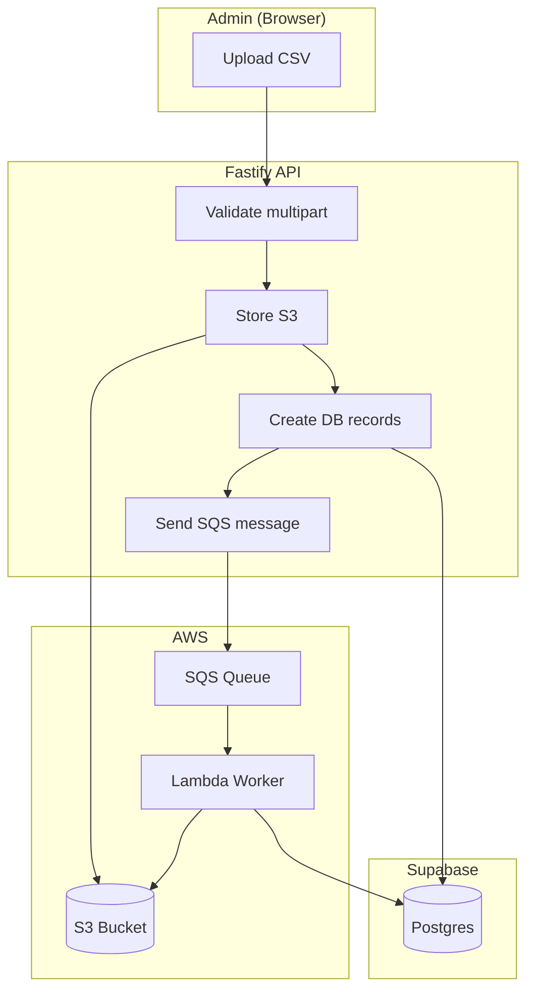
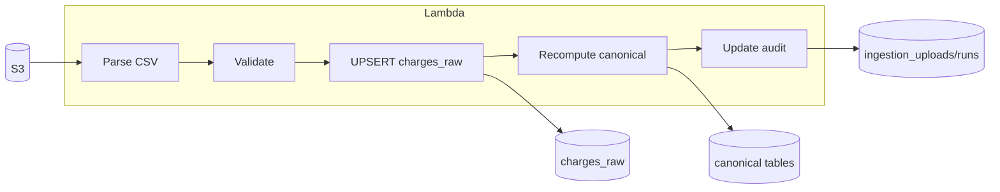
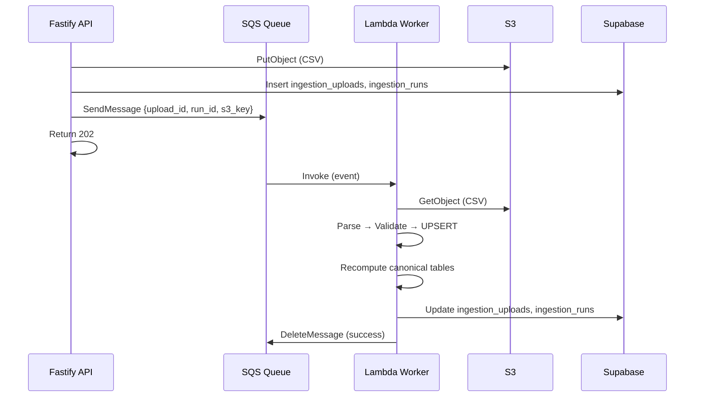
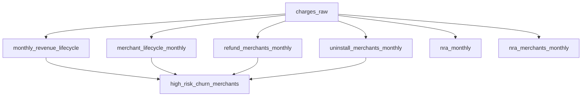

# Day 3: Ingestion Pipeline — Architecture and Implementation Guide

This article documents the **Day 3 ingestion pipeline** for MarketBuzz Compass: how CSV uploads flow from the API through SQS, Lambda, and into canonical tables. It serves as a pre-implementation spec and reference for developers.

---

## 1. What Is Day 3?

Day 3 builds the **ingestion pipeline** that:

1. Parses Clover CSV files (per `CLOVER_CSV_SCHEMA.md`)
2. Validates rows (fail-fast rules per `INGESTION_WORKFLOW.md`)
3. UPSERTs into `charges_raw` (dedupe by Charge ID)
4. Recomputes canonical monthly tables (materialized)
5. Updates audit records (`ingestion_uploads`, `ingestion_runs`)

The pipeline runs **asynchronously** via **SQS → Lambda**, so the API returns quickly after storing the CSV in S3.

---

## 2. High-Level Architecture

```
┌─────────────────────────────────────────────────────────────────────────────────┐
│                           ADMIN UPLOADS CSV (POST /admin/upload/csv)              │
└─────────────────────────────────────────────────────────────────────────────────┘
                                        │
                                        ▼
┌─────────────────────────────────────────────────────────────────────────────────┐
│  FASTIFY API (apps/api)                                                          │
│  • Validate multipart                                                            │
│  • Check headers (Charge ID, Charge Date, etc.)                                  │
│  • Create ingestion_uploads + ingestion_runs records                              │
│  • Upload CSV to S3                                                               │
│  • Send message to SQS                                                            │
│  • Return 202 { upload_id, run_id, status: "pending" }                            │
└─────────────────────────────────────────────────────────────────────────────────┘
                                        │
                    ┌───────────────────┼───────────────────┐
                    │                   │                   │
                    ▼                   ▼                   ▼
           ┌──────────────┐   ┌──────────────┐   ┌──────────────────┐
           │  S3 Bucket   │   │   Supabase   │   │  SQS Queue       │
           │  (CSV file)  │   │  (audit DB)  │   │  (job message)   │
           └──────────────┘   └──────────────┘   └────────┬─────────┘
                                                          │
                                                          │  triggers
                                                          ▼
┌─────────────────────────────────────────────────────────────────────────────────┐
│  LAMBDA (ingestion worker)                                                         │
│  • Receive SQS message { upload_id, run_id, s3_key }                              │
│  • Fetch CSV from S3                                                               │
│  • Parse → Validate → UPSERT charges_raw                                          │
│  • Recompute canonical tables (months_affected + prev month)                       │
│  • Update ingestion_uploads (status: success/failure)                             │
│  • Update ingestion_runs (counts, recompute_status, finished_at)                  │
└─────────────────────────────────────────────────────────────────────────────────┘
                                        │
                                        ▼
┌─────────────────────────────────────────────────────────────────────────────────┐
│  SUPABASE (Postgres)                                                              │
│  • charges_raw           (UPSERT by charge_id)                                    │
│  • monthly_revenue_lifecycle                                                      │
│  • merchant_lifecycle_monthly                                                     │
│  • nra_monthly, nra_merchants_monthly                                             │
│  • refund_merchants_monthly, uninstall_merchants_monthly                           │
│  • high_risk_churn_merchants                                                      │
└─────────────────────────────────────────────────────────────────────────────────┘
```

---

## 3. End-to-End Flow (Step by Step)

```
┌─────────────┐    ┌─────────────┐    ┌─────────────┐    ┌─────────────┐
│   Admin     │    │   API       │    │   SQS       │    │   Lambda    │
│   (Browser) │    │   (Fastify) │    │   Queue     │    │   Worker    │
└──────┬──────┘    └──────┬──────┘    └──────┬──────┘    └──────┬──────┘
       │                  │                  │                  │
       │  POST CSV        │                  │                  │
       │─────────────────►│                  │                  │
       │                  │                  │                  │
       │                  │  Store S3        │                  │
       │                  │  Create DB rows  │                  │
       │                  │  SendMessage     │                  │
       │                  │─────────────────►│                  │
       │                  │                  │                  │
       │  202 Accepted    │                  │  event trigger   │
       │◄─────────────────│                  │─────────────────►│
       │                  │                  │                  │
       │                  │                  │                  │  GetObject S3
       │                  │                  │                  │  Parse CSV
       │                  │                  │                  │  UPSERT
       │                  │                  │                  │  Recompute
       │                  │                  │                  │  Update DB
       │                  │                  │                  │
       │                  │  (UI polls       │                  │
       │                  │   status later)  │                  │
       │                  │                  │                  │
```

---

## 4. Component Breakdown

### 4.1 API (Upload Endpoint)

| Responsibility | Details |
|----------------|---------|
| Accept multipart CSV | Via `@fastify/multipart` |
| Validate headers | Required columns per `INGESTION_WORKFLOW.md` |
| Create `ingestion_uploads` | `upload_id`, `uploaded_by_user_id`, `status: pending` |
| Upload to S3 | Key: `clover_csv/{yyyy}/{mm}/{upload_id}.csv` |
| Create `ingestion_runs` | `run_id`, `upload_id`, `recompute_status: pending` |
| Send SQS message | Body: `{ upload_id, run_id, s3_key }` |
| Return 202 | `{ upload_id, run_id, status: "pending" }` |

### 4.2 SQS Queue

| Setting | Value |
|---------|-------|
| Name | `marketbuzz-compass-ingestion` |
| Message format | JSON: `{ upload_id, run_id, s3_key }` |
| Visibility timeout | ≥ Lambda timeout (e.g. 15 min) |
| Retries | 3 before DLQ |
| Dead-letter queue | Optional, for failed messages |

### 4.3 Lambda (Ingestion Worker)

| Responsibility | Details |
|----------------|---------|
| Trigger | SQS event source mapping |
| Timeout | 10–15 min (large CSVs) |
| Memory | 512 MB–1 GB |
| Environment | `SUPABASE_URL`, `SUPABASE_SERVICE_ROLE_KEY`, `S3_BUCKET_UPLOADS` |
| IAM | S3 GetObject, SQS ReceiveMessage/DeleteMessage, supabase (no VPC needed for Supabase) |

### 4.4 Ingestion Pipeline (inside Lambda)

| Stage | Module | Purpose |
|-------|--------|---------|
| 1 | Parser | Parse Clover CSV rows → normalized charge objects |
| 2 | Validator | Fail-fast on missing/invalid data |
| 3 | Upsert | Batch UPSERT into `charges_raw` by `charge_id` |
| 4 | Recompute | Refresh canonical tables for `months_affected` + prev month |
| 5 | Audit | Update `ingestion_uploads` and `ingestion_runs` |

---

## 5. Data Flow: CSV → charges_raw → Canonical Tables

```
┌─────────────────────────────────────────────────────────────────┐
│  CLOVER CSV (S3)                                                 │
│  Charge ID, Charge Date, Merchant ID, Amount, Status, ...         │
└─────────────────────────────────┬───────────────────────────────┘
                                  │
                                  │  Parse + Normalize
                                  │  • charge_month = YYYY-MM-01
                                  │  • status_current: REFUNDED → REFUND; BILLED, ONHOLD, COLLECTED, DEPOSITED kept as-is (ONHOLD for future calculations)
                                  │  • amount: decimal
                                  ▼
┌─────────────────────────────────────────────────────────────────┐
│  charges_raw (UPSERT by charge_id)                                │
│  charge_id, charge_date, charge_month, merchant_id, app_id,      │
│  amount, status_current, uninstall_date, last_seen_at, ...       │
└─────────────────────────────────┬───────────────────────────────┘
                                  │
                                  │  Recompute (DELETE + INSERT per month)
                                  │  Scope: months in CSV + previous month
                                  ▼
┌─────────────────────────────────────────────────────────────────┐
│  CANONICAL TABLES (materialized)                                  │
├─────────────────────────────────────────────────────────────────┤
│  1. monthly_revenue_lifecycle   │ billed, collected, refunded    │
│  2. merchant_lifecycle_monthly  │ Active, AtRisk, Lost            │
│  3. nra_monthly                │ New Revenue Added (app-level)  │
│  4. nra_merchants_monthly       │ NRA at merchant level          │
│  5. refund_merchants_monthly    │ Refunded in month              │
│  6. uninstall_merchants_monthly│ Uninstalled in month           │
│  7. high_risk_churn_merchants   │ Refunded ∩ Uninstalled ∩ Lost  │
└─────────────────────────────────────────────────────────────────┘
```

---

## 6. Recompute Scope and Order

**Months to recompute:**

- Months detected in CSV (from `charge_month` values)
- **Plus previous month** (needed for At Risk: billed in M-1, not M)

Example: CSV has Dec, Jan, Feb → recompute **Nov, Dec, Jan, Feb**.

**Recompute order (per INGESTION_WORKFLOW.md):**

1. `monthly_revenue_lifecycle`
2. `merchant_lifecycle_monthly`
3. `refund_merchants_monthly`, `uninstall_merchants_monthly`
4. `nra_monthly`, `nra_merchants_monthly`
5. `high_risk_churn_merchants`
6. `growth_forecast_monthly` (optional Phase-1)

**Idempotency:** `DELETE FROM table WHERE month IN (months_scope)` then `INSERT` for each table.

---

## 7. File Structure (Proposed)

```
apps/api/
  src/
    ingestion/
      parser.ts        # Parse Clover CSV → ParsedCharge[]
      validator.ts     # Fail-fast validation
      upsert.ts        # UPSERT into charges_raw, return counts
      recompute.ts     # Recompute canonical tables
      pipeline.ts      # runIngestion(uploadId, runId, s3Key)
    services/
      s3.ts            # uploadCsv, getCsv (for Lambda)
      sqs.ts           # sendIngestionJob(uploadId, runId, s3Key)
    lambda/
      ingestion.ts     # Lambda handler: SQS event → runIngestion
    routes/admin/
      upload.ts        # Calls sendIngestionJob after S3 upload
```

---

## 8. Message and Error Handling

| Scenario | Behavior |
|----------|----------|
| Parse fails | Mark `ingestion_uploads` + `ingestion_runs` as failure; do not touch DB |
| Upsert fails mid-way | Rollback; mark failure |
| Recompute fails | Keep `charges_raw`; mark `recompute_status: failure`; no Nova trigger |
| Lambda throws | SQS retries (visibility timeout); after max retries → DLQ |
| Duplicate message | Idempotent: UPSERT overwrites; recompute replaces by month |

---

## 9. Implementation Order

| Step | Task | Depends On |
|------|------|------------|
| 1 | Parser: parse one row, then full file | — |
| 2 | Validator: validation rules | Parser |
| 3 | S3: add `getCsv(s3Key)` | — |
| 4 | Upsert: batch UPSERT charges_raw | Parser |
| 5 | Recompute: each canonical table in order | Upsert |
| 6 | Pipeline: `runIngestion()` orchestrates all | Parser, Validator, Upsert, Recompute |
| 7 | SQS: create queue, `sendIngestionJob()` | — |
| 8 | Upload route: call `sendIngestionJob` after S3 | SQS |
| 9 | Lambda handler: SQS event → runIngestion | Pipeline, S3 getCsv |
| 10 | Infra: SQS queue, Lambda, IAM, event source | Lambda handler |

---

## 10. Related Documents

| Document | Purpose |
|----------|---------|
| `docs/INGESTION_WORKFLOW.md` | Validation, upsert rules, recompute order, error handling |
| `docs/CLOVER_CSV_SCHEMA.md` | CSV column layout, parsing rules, status mapping |
| `docs/DATA_MODEL_SPEC.md` | charges_raw and canonical table schemas |
| `docs/PROGRESS.md` | Day 3 checklist, handoff |
| `AGENTS.md` | Project rules, conventions |

---

## Appendix: Mermaid Diagrams

### System architecture overview



### Ingestion pipeline (inside Lambda)



### SQS → Lambda flow



### Recompute dependency order



---

*Document created for MarketBuzz Compass Day 3 implementation. Use this as the reference before and during implementation.*
