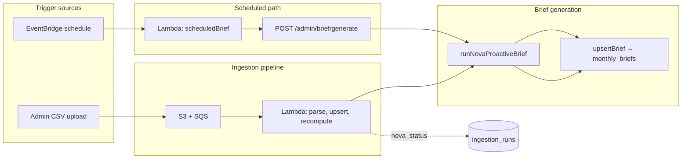
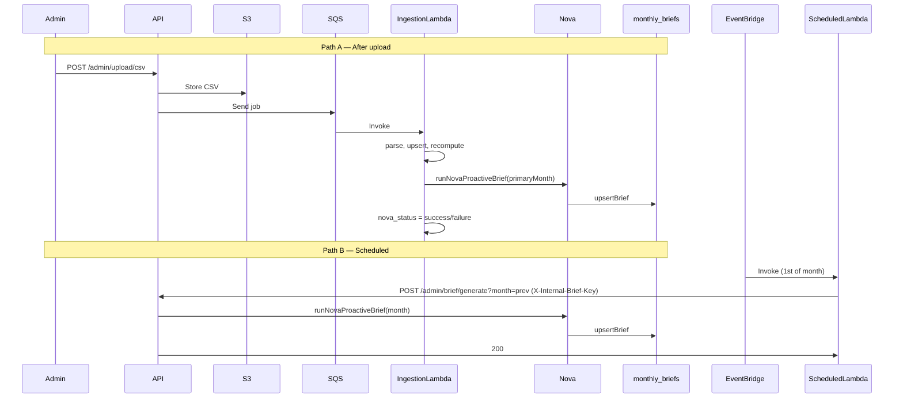

# Proactive Brief Trigger — Architecture

This article describes how the **proactive monthly brief** is triggered in MarketBuzz Compass: both **after upload** (ingestion pipeline) and **on a schedule** (EventBridge + Lambda). It explains the design, data flow, and how the two triggers share the same Nova brief generation and internal auth.

---

## Why a Proactive Brief?

The Monthly Brief is Nova’s narrative over canonical KPIs (Gross Billed, Active Merchants, Refunds, At Risk, etc.). Users expect it to reflect the latest data. Two situations matter:

1. **After a CSV upload** — New data has been ingested and canonical tables recomputed; the brief for the affected month(s) should be regenerated so the UI shows an up-to-date narrative without an admin manually clicking “Generate brief.”
2. **Monthly close** — Even when no one uploads a CSV, the team may want the brief for the **previous month** refreshed on a fixed cadence (e.g. 1st of the month), so the Brief page is always current for the latest closed month.

So we need **two trigger points** that both lead to the same outcome: run Nova proactive brief and upsert into `monthly_briefs`.

---

## High-Level Architecture

- **After upload:** CSV → S3 → SQS → ingestion Lambda → parse, upsert, recompute → **then** (in the same pipeline) `runNovaProactiveBrief` + `upsertBrief` → update `ingestion_runs.nova_status`.
- **Scheduled:** EventBridge (e.g. 1st of month) → scheduled-brief Lambda → HTTP `POST /admin/brief/generate?month=...` with internal key → same `runNovaProactiveBrief` + `upsertBrief` inside the API.

Both paths write to the same table (`monthly_briefs`) and use the same Nova workflow; only the **trigger** and **month selection** differ.

---

## Trigger 1: After Upload

**When:** Right after the ingestion pipeline has successfully recomputed canonical tables for an upload.

**Where:** `apps/api/src/ingestion/pipeline.ts` (same process as the ingestion Lambda that runs `runIngestion`).

**Flow:**

1. Upload completes → CSV in S3, message in SQS.
2. Ingestion Lambda runs: validate CSV, upsert `charges_raw`, recompute `monthly_revenue_lifecycle`, `merchant_lifecycle_monthly`, etc.
3. Pipeline updates `ingestion_runs` with `recompute_status: "success"` and `months_affected`.
4. **Proactive brief step:**
   - Pick the **latest** month in `monthsDetected` (e.g. `["2025-12", "2026-01", "2026-02"]` → `2026-02-01`).
   - If `OPENAI_API_KEY` is set, call `runNovaProactiveBrief({ month: primaryMonth, created_by: "ingestion" })`.
   - On success: `upsertBrief(...)` into `monthly_briefs`; set `ingestion_runs.nova_status = "success"`.
   - On failure: set `ingestion_runs.nova_status = "failure"` and `error_message`; **do not** fail the ingestion (pipeline still returns success).
5. Admin (and UI) can see Nova status per run in the upload status list.

**Why in-pipeline:** Data is already fresh; no extra HTTP call; same Lambda/env already have DB and OpenAI. Failure of Nova is isolated to `nova_status` so ingestion remains auditable as “succeeded.”

---

## Trigger 2: Scheduled (EventBridge + Lambda)

**When:** On a schedule (e.g. 1st of each month at 02:00 UTC).

**Where:** A separate Lambda (`scheduledBrief.ts`) invoked by EventBridge, which **calls the API** over HTTP.

**Flow:**

1. EventBridge rule fires (e.g. `cron(0 2 1 * ? *)`).
2. Lambda runs: compute **previous month** (e.g. today 2026-02-01 → `2026-01-01`).
3. Lambda sends `POST {API_URL}/admin/brief/generate?month=2026-01-01` with header `X-Internal-Brief-Key: <INTERNAL_BRIEF_API_KEY>`.
4. API route accepts the request via **internal auth** (see below), then runs the same `runNovaProactiveBrief` + `upsertBrief` as the admin or pipeline path.
5. Response 200 → brief for that month is updated in `monthly_briefs`.

**Why HTTP:** The scheduled Lambda does not need the full API codebase or DB; it only needs to trigger the existing endpoint. That keeps the scheduled path simple and reuses one implementation of brief generation.

---

## Shared Endpoint and Internal Auth

`POST /admin/brief/generate` is used by:

- **Admin UI** — user (Cognito Admin) clicks “Generate brief”; request sends JWT.
- **Scheduled Lambda** — no user; request sends internal key.

So the route must accept **either** a valid Cognito Admin JWT **or** a valid internal secret. That’s what **internal auth** does:

- **Middleware:** `requireAdminOrInternalBriefKey` (in `auth/middleware.ts`).
  - If `X-Internal-Brief-Key` or `Authorization: Bearer <value>` equals `INTERNAL_BRIEF_API_KEY`, treat the request as authorized (e.g. set `request.user` with Admin).
  - Otherwise run normal Cognito auth and `requireAdmin`.
- **Config:** `INTERNAL_BRIEF_API_KEY` in API `.env`; same value in the scheduled Lambda env.

So:

- After-upload path does **not** use this endpoint; it calls `runNovaProactiveBrief` and `upsertBrief` directly inside the ingestion process.
- Scheduled path is the only one that needs the internal key to call the API without a user JWT.

---

## Month Selection

| Trigger     | Month used                                      |
|------------|--------------------------------------------------|
| After upload | Latest month in `monthsDetected` (e.g. `2026-02-01`) |
| Scheduled  | Previous calendar month (e.g. run on 2026-02-01 → `2026-01-01`) |

After upload we want the brief for the **most recent month we just recomputed**. On schedule we want the **last closed month**, which is always “previous month” from the run date.

---

## Data Flow Summary

---

## Components Reference

| Component | Role |
|-----------|------|
| `ingestion/pipeline.ts` | After recompute success: calls `runNovaProactiveBrief` + `upsertBrief`; updates `ingestion_runs.nova_status`. |
| `routes/admin/brief.ts` | `POST /admin/brief/generate`: accepts Admin JWT or internal key; runs same Nova brief + upsert. |
| `auth/middleware.ts` | `requireAdminOrInternalBriefKey`: validates internal key or Cognito Admin. |
| `lambda/scheduledBrief.ts` | EventBridge handler: previous month, POST to API with `X-Internal-Brief-Key`. |
| `monthly_briefs` | Single cache table for brief markdown and headline KPIs; UI reads from here. |
| `ingestion_runs.nova_status` | `pending` / `success` / `failure` for “after upload” brief run. |

---

## Related Docs

- **Setup (scheduled trigger):** [scheduled-brief-lambda-eventbridge.md](./scheduled-brief-lambda-eventbridge.md) — Lambda creation, EventBridge rule, env vars.
- **Ingestion flow:** [INGESTION_WORKFLOW.md](../INGESTION_WORKFLOW.md) § Trigger Nova (Proactive Mode).
- **Nova:** [nova-architecture-and-business-value.md](./nova-architecture-and-business-value.md).
