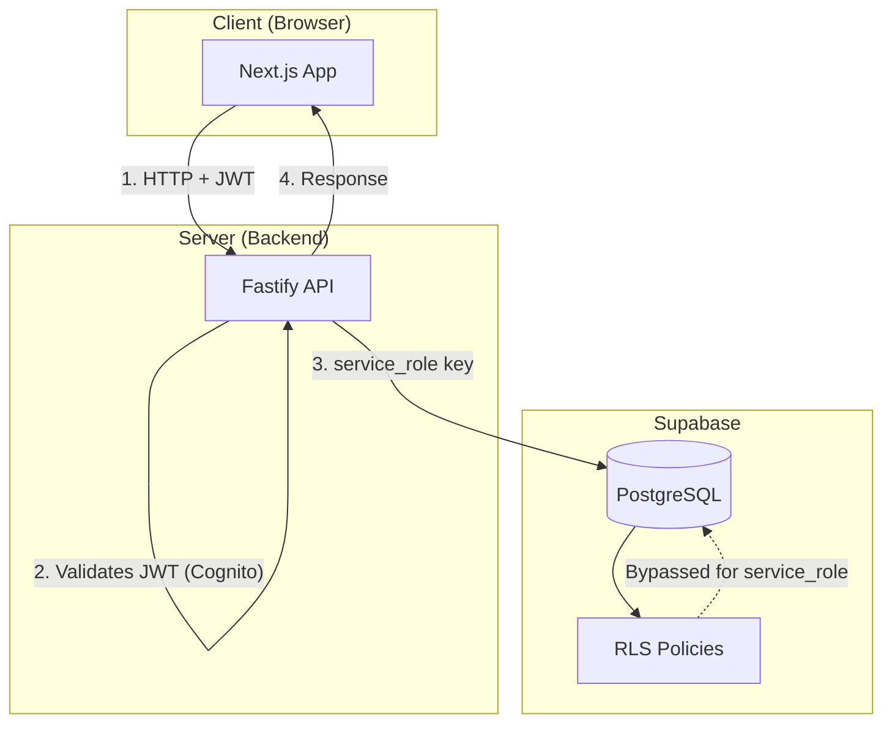
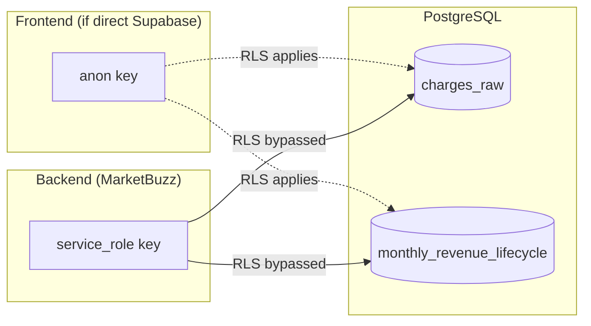
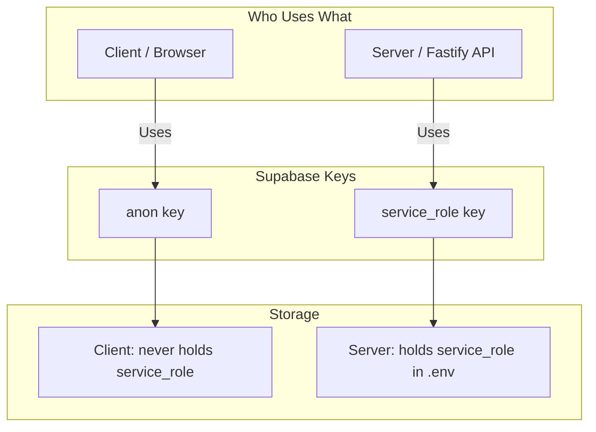
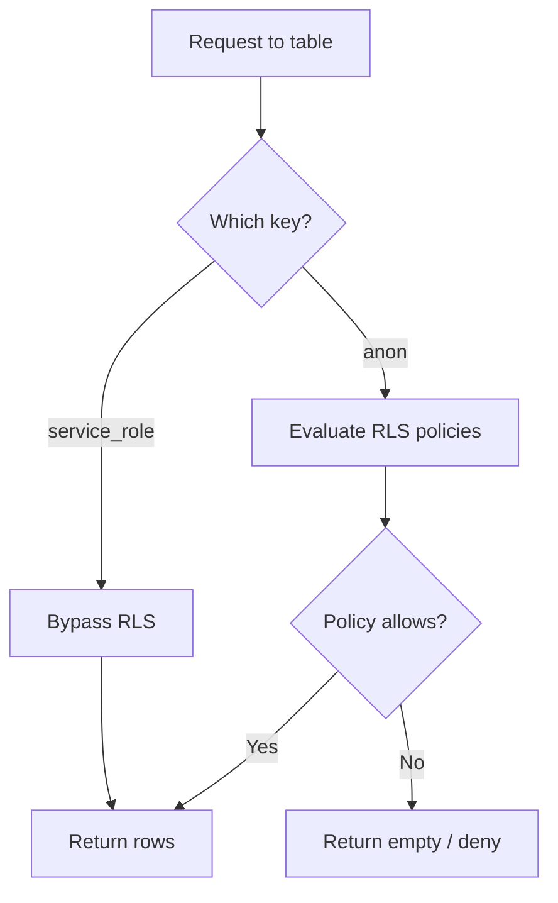

# PostgreSQL & Supabase RLS Decisions — MarketBuzz Compass

This document records **Row Level Security (RLS)** decisions for MarketBuzz Compass, including how Supabase keys, client/server roles, and RLS interact.

---

## 1) Supabase Keys Overview

Supabase provides two API keys for connecting to your project:

| Key | Purpose | RLS Behavior |
|-----|---------|--------------|
| **anon (public)** | Frontend, public clients | RLS **applies** — policies restrict which rows can be read/written |
| **service_role** | Backend, server-side only | RLS **bypassed** — full access to all tables |

---

## 2) Architecture Diagram — Request Flow



**Flow:**
1. User logs in via Cognito → gets JWT.
2. Frontend sends requests to Fastify API with JWT.
3. API validates JWT and enforces RBAC (Admin/Viewer).
4. API connects to Supabase using **service_role** key → RLS bypassed.
5. API returns data to frontend.

---

## 3) Key Usage Diagram



**Current design:** Only the backend uses Supabase. Frontend does **not** connect directly to Supabase.

---

## 4) RLS Decision Summary

| Decision | Choice | Rationale |
|----------|--------|-----------|
| **MVP** | **RLS tripwire enabled** | Enable RLS + deny-all policy on internal tables. Prevents accidental future exposure if someone adds Supabase client usage. Cheap guardrail. |
| **Scope** | RLS protects against direct Supabase access only | It does **not** protect against API mistakes — service_role bypasses RLS. |
| **Auth** | Cognito, not Supabase Auth | RLS typically uses `auth.uid()` — we use Cognito JWT, so Supabase Auth context is empty. |

---

## 5) Client vs Server vs Keys



| Actor | Key Used | Where Stored | Purpose |
|-------|----------|--------------|---------|
| **Client (Next.js)** | anon (if using Supabase directly) | Public, in frontend env | Real-time, optional direct queries |
| **Server (Fastify)** | service_role | `.env` (never exposed) | All DB access for MarketBuzz API |

**MarketBuzz Compass:** Frontend does **not** connect to Supabase. All requests go through the API. The API uses `service_role` from `.env`.

---

## 6) How RLS Works (When Enabled)



**When RLS is enabled:**
- **anon:** Each SELECT/INSERT/UPDATE/DELETE is checked against policies. Only rows that pass are returned or modified.
- **service_role:** All policies are skipped. Full access.

---

## 7) What RLS Protects vs Does NOT Protect

### RLS protects against

| Threat | How |
|--------|-----|
| **Direct Supabase client usage** | If someone adds `@supabase/supabase-js` in the frontend with anon key, RLS blocks access. |
| **Accidental future exposure** | Tripwire catches mistakes before they reach production. |

### RLS does NOT protect against (service_role bypasses it)

| Threat | Reality |
|--------|---------|
| **API bugs** | IDOR, wrong filters, returning all rows — API has full access. |
| **Debug endpoints** | Misconfigured routes that leak data. |
| **SSRF / edge-case paths** | Any path that hits internal endpoints. |

**Bottom line:** The API is the main security boundary. Safety depends on:
- Perfect endpoint authorization (JWT + RBAC)
- Correct scoping on every query (month, app_id, user context)
- No IDOR bugs
- No accidental "return all rows"
- No debug endpoints or misconfigured routes

RLS is a cheap tripwire for direct Supabase access. DB-level guardrails are cheap; fixing a leak later is expensive.

---

## 8) Recommended: RLS Tripwire Policy (MVP)

**Enable RLS and deny anon/authenticated on internal tables.** This prevents accidental future exposure if someone later adds Supabase client usage.

Migration: `supabase/migrations/20240207000009_enable_rls_tripwire.sql`

```sql
-- Tripwire: block anon/authenticated access to internal tables
-- API uses service_role and bypasses these policies
-- Protects against: direct Supabase client usage, accidental future exposure

ALTER TABLE charges_raw ENABLE ROW LEVEL SECURITY;
CREATE POLICY "charges_raw_tripwire" ON charges_raw FOR ALL USING (false);

ALTER TABLE ingestion_uploads ENABLE ROW LEVEL SECURITY;
CREATE POLICY "ingestion_uploads_tripwire" ON ingestion_uploads FOR ALL USING (false);

ALTER TABLE ingestion_runs ENABLE ROW LEVEL SECURITY;
CREATE POLICY "ingestion_runs_tripwire" ON ingestion_runs FOR ALL USING (false);

ALTER TABLE monthly_revenue_lifecycle ENABLE ROW LEVEL SECURITY;
CREATE POLICY "mrl_tripwire" ON monthly_revenue_lifecycle FOR ALL USING (false);

ALTER TABLE merchant_lifecycle_monthly ENABLE ROW LEVEL SECURITY;
CREATE POLICY "mlm_tripwire" ON merchant_lifecycle_monthly FOR ALL USING (false);

ALTER TABLE nra_monthly ENABLE ROW LEVEL SECURITY;
CREATE POLICY "nra_monthly_tripwire" ON nra_monthly FOR ALL USING (false);

ALTER TABLE nra_merchants_monthly ENABLE ROW LEVEL SECURITY;
CREATE POLICY "nra_merchants_tripwire" ON nra_merchants_monthly FOR ALL USING (false);

ALTER TABLE refund_merchants_monthly ENABLE ROW LEVEL SECURITY;
CREATE POLICY "refund_merchants_tripwire" ON refund_merchants_monthly FOR ALL USING (false);

ALTER TABLE uninstall_merchants_monthly ENABLE ROW LEVEL SECURITY;
CREATE POLICY "uninstall_merchants_tripwire" ON uninstall_merchants_monthly FOR ALL USING (false);

ALTER TABLE high_risk_churn_merchants ENABLE ROW LEVEL SECURITY;
CREATE POLICY "high_risk_churn_tripwire" ON high_risk_churn_merchants FOR ALL USING (false);

ALTER TABLE package_catalog ENABLE ROW LEVEL SECURITY;
CREATE POLICY "package_catalog_tripwire" ON package_catalog FOR ALL USING (false);

ALTER TABLE growth_forecast_monthly ENABLE ROW LEVEL SECURITY;
CREATE POLICY "growth_forecast_tripwire" ON growth_forecast_monthly FOR ALL USING (false);

ALTER TABLE monthly_briefs ENABLE ROW LEVEL SECURITY;
CREATE POLICY "monthly_briefs_tripwire" ON monthly_briefs FOR ALL USING (false);
```

**Effect:** If anyone uses the anon key directly against these tables, they get no rows. The API (service_role) is unaffected.

---

## 9) Key Security Rules

| Rule | Why |
|------|-----|
| **Never expose service_role to the client** | It bypasses RLS and has full DB access. |
| **anon key can be public** | It’s meant for frontend; RLS (if enabled) limits what it can do. |
| **Store service_role in server .env only** | Backend reads it; never included in client bundles. |
| **Use .gitignore for .env** | Prevents committing secrets. |

---

## 10) Summary

- **Client:** Uses Cognito JWT; talks only to the Fastify API.
- **Server:** Uses `service_role` to access Supabase; RLS is bypassed.
- **RLS:** Tripwire enabled on all internal tables — denies anon/authenticated access. Protects against direct Supabase client usage only; does **not** protect against API mistakes.
- **Auth:** Handled by Cognito and API middleware, not by Supabase RLS.

---

## Related Docs

- [login_management.md](./login_management.md) — Cognito setup
- [DATA_MODEL_SPEC.md](./DATA_MODEL_SPEC.md) — Table definitions
- [TECHNICAL_ARCHITECTURE.md](./TECHNICAL_ARCHITECTURE.md) — System architecture
