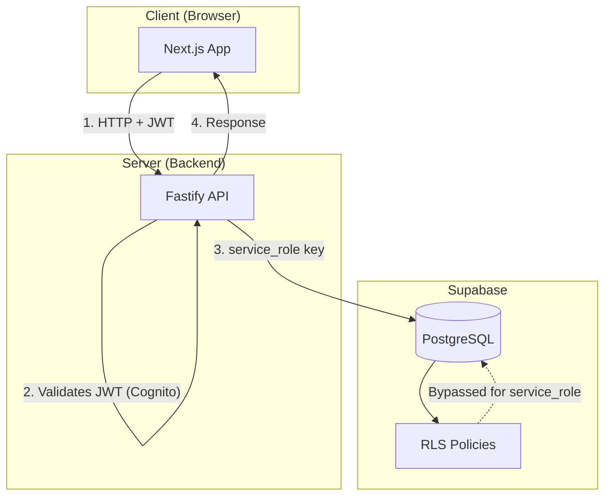
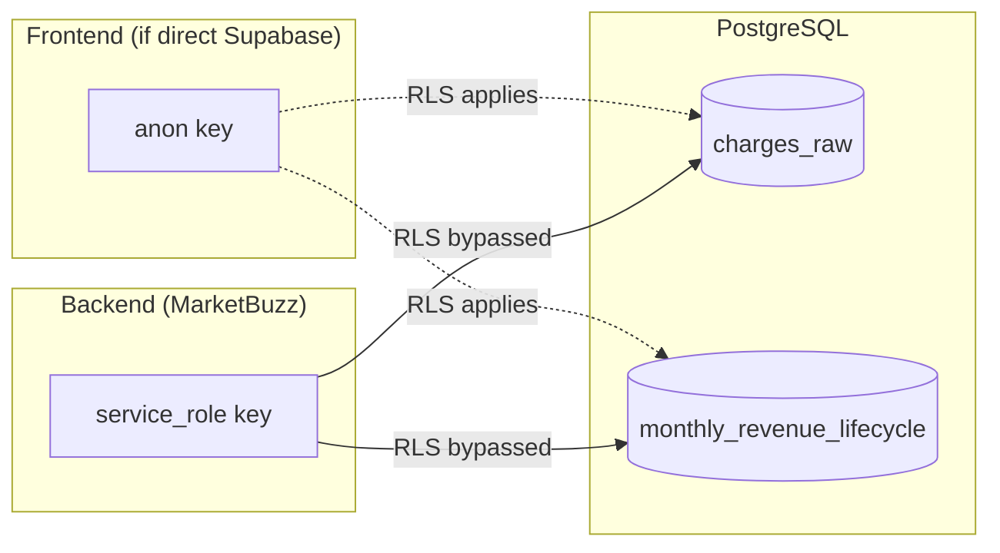
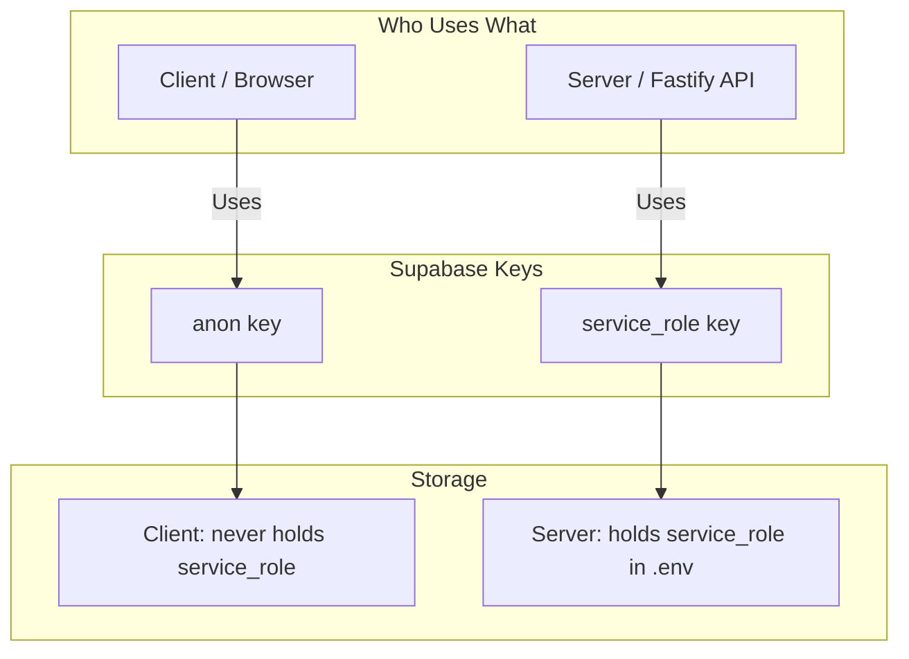
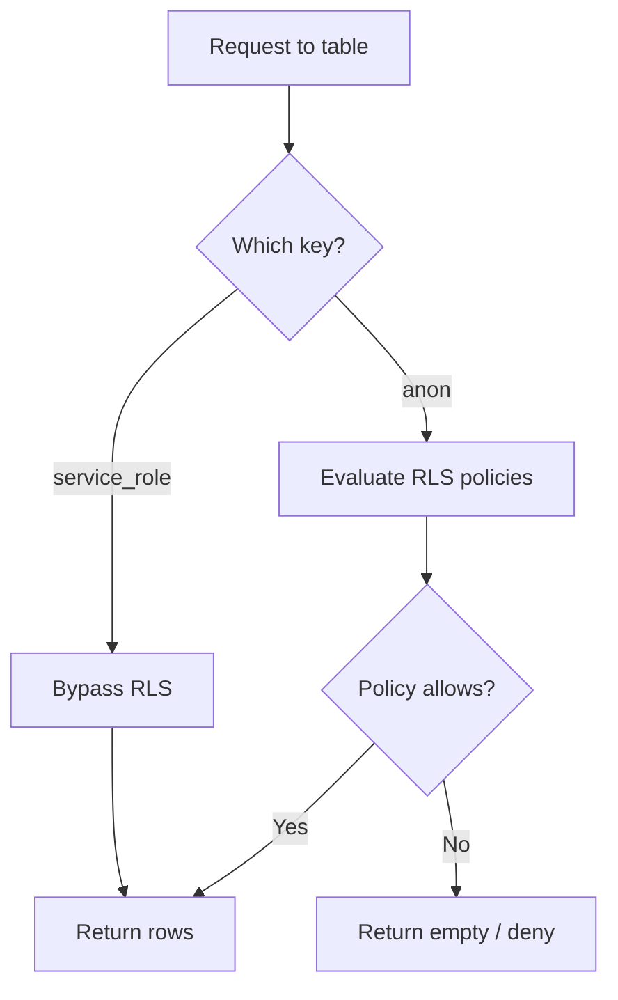

# PostgreSQL & Supabase RLS Decisions — MarketBuzz Compass

This document records **Row Level Security (RLS)** decisions for MarketBuzz Compass, including how Supabase keys, client/server roles, and RLS interact.

---

## 1) Supabase Keys Overview

Supabase provides two API keys for connecting to your project:

| Key | Purpose | RLS Behavior |
|-----|---------|--------------|
| **anon (public)** | Frontend, public clients | RLS **applies** — policies restrict which rows can be read/written |
| **service_role** | Backend, server-side only | RLS **bypassed** — full access to all tables |

---

## 2) Architecture Diagram — Request Flow



**Flow:**
1. User logs in via Cognito → gets JWT.
2. Frontend sends requests to Fastify API with JWT.
3. API validates JWT and enforces RBAC (Admin/Viewer).
4. API connects to Supabase using **service_role** key → RLS bypassed.
5. API returns data to frontend.

---

## 3) Key Usage Diagram



**Current design:** Only the backend uses Supabase. Frontend does **not** connect directly to Supabase.

---

## 4) RLS Decision Summary

| Decision | Choice | Rationale |
|----------|--------|-----------|
| **MVP** | RLS disabled (rely on API auth) | All DB access through API with service_role. No direct Supabase access from frontend. |
| **Production** | Optional RLS for defense-in-depth | If enabled, policies deny anon access to internal tables. |
| **Auth** | Cognito, not Supabase Auth | RLS typically uses `auth.uid()` — we use Cognito JWT, so Supabase Auth context is empty. |

---

## 5) Client vs Server vs Keys



| Actor | Key Used | Where Stored | Purpose |
|-------|----------|--------------|---------|
| **Client (Next.js)** | anon (if using Supabase directly) | Public, in frontend env | Real-time, optional direct queries |
| **Server (Fastify)** | service_role | `.env` (never exposed) | All DB access for MarketBuzz API |

**MarketBuzz Compass:** Frontend does **not** connect to Supabase. All requests go through the API. The API uses `service_role` from `.env`.

---

## 6) How RLS Works (When Enabled)



**When RLS is enabled:**
- **anon:** Each SELECT/INSERT/UPDATE/DELETE is checked against policies. Only rows that pass are returned or modified.
- **service_role:** All policies are skipped. Full access.

---

## 7) Why We Skip RLS for MVP

1. **Single access path** — All DB access goes through the API. No direct Supabase client in the frontend.
2. **Auth at API layer** — Cognito JWT validation and Admin/Viewer checks happen in Fastify, not in PostgreSQL.
3. **service_role bypasses RLS** — The API uses service_role, so RLS would not apply to our current traffic.
4. **Cognito vs Supabase Auth** — RLS policies rely on `auth.uid()` from Supabase Auth. We use Cognito, so `auth.uid()` is not set. Defining useful RLS would require custom JWT configuration.

---

## 8) Optional: RLS for Defense-in-Depth

If we later enable RLS, recommended approach:

```sql
-- Block anon access to internal tables
-- (API still uses service_role and bypasses these)

ALTER TABLE charges_raw ENABLE ROW LEVEL SECURITY;
CREATE POLICY "charges_raw_internal" ON charges_raw
  FOR ALL USING (false);  -- No anon access

ALTER TABLE monthly_revenue_lifecycle ENABLE ROW LEVEL SECURITY;
CREATE POLICY "mrl_internal" ON monthly_revenue_lifecycle
  FOR ALL USING (false);
```

**Effect:** If anyone ever uses the anon key directly against these tables, they get no rows. The API (service_role) is unaffected.

---

## 9) Key Security Rules

| Rule | Why |
|------|-----|
| **Never expose service_role to the client** | It bypasses RLS and has full DB access. |
| **anon key can be public** | It’s meant for frontend; RLS (if enabled) limits what it can do. |
| **Store service_role in server .env only** | Backend reads it; never included in client bundles. |
| **Use .gitignore for .env** | Prevents committing secrets. |

---

## 10) Summary

- **Client:** Uses Cognito JWT; talks only to the Fastify API.
- **Server:** Uses `service_role` to access Supabase; RLS is bypassed.
- **RLS:** Not used for MVP; optional later for defense-in-depth.
- **Auth:** Handled by Cognito and API middleware, not by Supabase RLS.

---

## Related Docs

- [login_management.md](./login_management.md) — Cognito setup
- [DATA_MODEL_SPEC.md](./DATA_MODEL_SPEC.md) — Table definitions
- [TECHNICAL_ARCHITECTURE.md](./TECHNICAL_ARCHITECTURE.md) — System architecture
